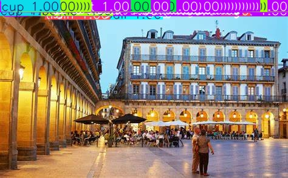
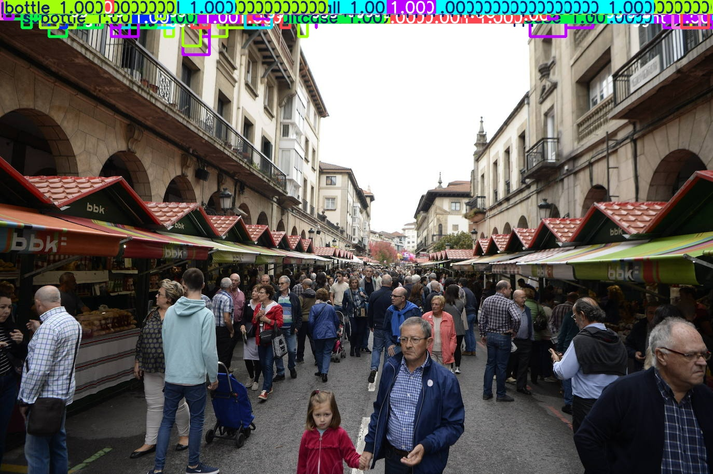

# Fault Injection in Ultralytics YOLO
Model: yolov8n
Fault Injection type: a single bitflip in the weights file
We found two bitflips which can break the model: 

## Results
Detected Classes in image 1: 1 motorcycle, 14 buss, 45 trains, 152 traffic lights, 8 suitcases, 16 sports balls, 55 bottles, 6 cups, 3 oranges
Detected Classes in image 2: 3 bicycles, 17 trains, 236 traffic lights, 6 sports balls, 29 bottles, 1 wine glass, 7 cups, 1 bowl

